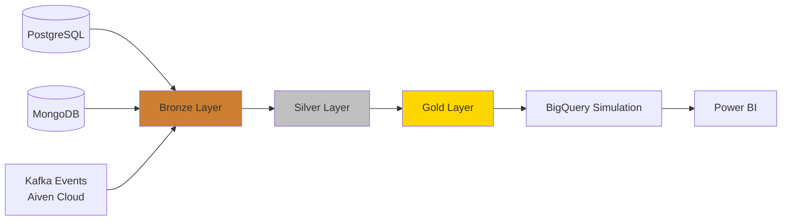

# End-to-End Streaming Data Platform

> A simulated sports-streaming data platform showcasing multi-source ingestion, event-driven processing, and Medallion Architecture — built end-to-end with Docker, Kafka, and Spark.

[]()
[]()
[]()

## Overview

This project simulates a real-world sports-streaming platform's data infrastructure, built to demonstrate practical, production-style data engineering skills.

It ingests data from multiple heterogeneous sources (PostgreSQL, MongoDB, and Kafka events), processes it through a Medallion Architecture (Bronze → Silver → Gold), and is designed around an event-driven, streaming-first philosophy — currently implemented as scheduled batch processing while the full continuous-streaming pipeline is developed.

The data infrastructure runs primarily on local Docker containers (Spark, databases, and a simulated GCS environment), with Kafka streaming managed via Aiven Cloud — a hybrid local-cloud setup adopted as a deliberate Phase 1 strategy to avoid cloud free-tier limitations during active development, with full cloud migration planned for Phase 2.



## Tech Stack

| Tool | Role | Why |
|------|------|-----|
| PostgreSQL | Relational source system | Simulates structured, transactional data (e.g., users, subscriptions) |
| MongoDB | NoSQL source system | Simulates semi-structured/document-based data |
| Kafka (Aiven Cloud) | Event streaming backbone | Decouples event production from consumption; enables event-driven architecture |
| Apache Spark | Distributed processing engine | Powers Bronze → Silver → Gold transformations across the pipeline |
| Docker | Local infrastructure orchestration | Runs the full stack (Spark, databases, fake-gcs) consistently across environments |
| fake-gcs-server | Simulated cloud storage | Mimics Google Cloud Storage locally, avoiding cloud costs during development |
| BigQuery (planned) | Analytics warehouse simulation | Target layer for Gold-level analytical queries |
| Power BI (planned) | Business intelligence layer | Final visualization layer for stakeholders |

## Current Status

🚧 Active Development — Phase 1

- ✅ Bronze Layer: Completed for all 3 sources (PostgreSQL, MongoDB, Kafka Events)
- 🔄 Silver Layer: In Progress (PostgreSQL — currently midway)
- ⏳ Mongo & Kafka Silver processing: Not started
- ⏳ Gold Layer: Not started
- ⏳ BigQuery Simulation & Power BI: Planned


## Quick Start

> **Note:** To conserve local resources, this project follows a "run-what-you-need" approach — services are started only when required for the current stage, rather than running the entire stack simultaneously. Once the full pipeline (Bronze → Silver → Gold) is complete, this will evolve into a single, fully orchestrated run without manual volume-based handoffs between stages.

> Prerequisites: Docker, and an active Kafka broker connection (Aiven Cloud)

1. Start core infrastructure (PostgreSQL, MongoDB) via Docker:
   ```bash
   docker-compose up -d postgres mongo
   ```

2. Load initial data into PostgreSQL (run first — other sources depend on its IDs):
   ```bash
   python scripts/load_postgres.py
   ```

3. Load data into MongoDB (depends on PostgreSQL-generated IDs):
   ```bash
   python scripts/load_mongo.py
   ```

4. Start the simulated cloud storage service (fake-gcs):
   ```bash
   docker-compose up -d fake-gcs
   ```

5. Set up storage buckets for each Medallion layer:
   ```bash
   python scripts/setup_storage.py
   ```

6. Ingest PostgreSQL data into the Bronze layer:
   ```bash
   python scripts/postgres_to_bronze.py
   ```

7. Ingest MongoDB data into the Bronze layer:
   ```bash
   python scripts/mongo_to_bronze.py
   ```

8. Ensure the Kafka broker is running, then start the Consumer (receives events and writes them to the Bronze bucket):
   ```bash
   python scripts/kafka_to_bronze.py.py
   ```

9. Start the Producer to begin sending events:
   ```bash
   python scripts/video_events_producer.py
   ```

At this point, raw data is persisted in the Bronze bucket as Parquet files, mounted via a local volume — ready for Silver layer processing.

10. Start Spark and Jupyter to begin Silver layer processing on the Bronze data:
    ```bash
    docker-compose up -d spark jupyter
    ```

```
.
├── docs/                       # Development notes and technical logs
├── kafka_scripts/               # Kafka producer script (currently single-file; planned for future expansion)
├── scripts/
│   ├── storage/                  # All storage-layer logic (currently fake-gcs based)
│   │   ├── bronze/              # Kafka consumer + Bronze-layer ingestion
│   │   ├── silver/notebooks/    # Silver-layer processing notebooks
│   │   └── setup_storage.py     # Bucket initialization
│   ├── generation/              # Fake data generation (PostgreSQL, MongoDB)
│   └── loading/                 # Initial data loaders (PostgreSQL, MongoDB)
├── .env                         # Environment variables (not committed)
├── ca.pem                       # SSL certificate for Kafka/Aiven (not committed)
├── config.py                    # Project configuration
├── docker-compose.yml           # Local infrastructure setup
├── Dockerfile                   # Custom image definition
└── README.md
```